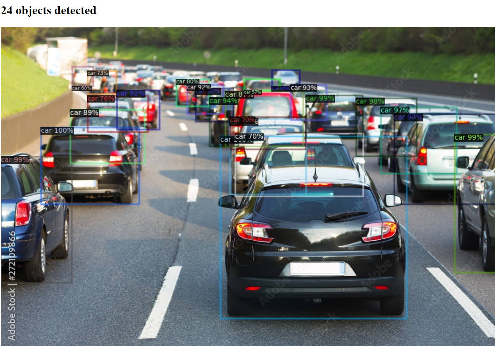

# detectron2-demo

This repo is an object detection model served by a simple web application. By default it is set to detect cars ("car", "truck", "bus" COCO classes)

## Usage

Once the application in running, go to `localhost:5000` at your browser. Select image for the detection and press "Submit" button. After a few seconds the image with detected bounding boxes will be shown.

### Set up with Docker
1. clone this repository and `cd` inside
2. build Docker image with `docker build -t det2demo:latest .`
3. run docker with `docker run -it -p 5000:5000 det2demo`
4. the model is served at `http://localhost:5000`

## About

This application uses Mask R-CNN model trained on COCO dataset.

Object detection functions are located in `detection_tools.py`
Web API is coded in `main.py`
